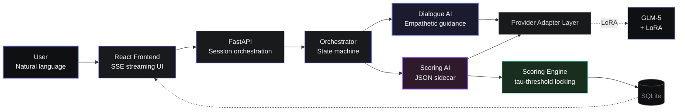
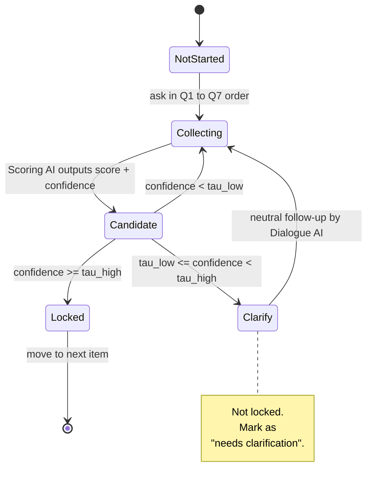
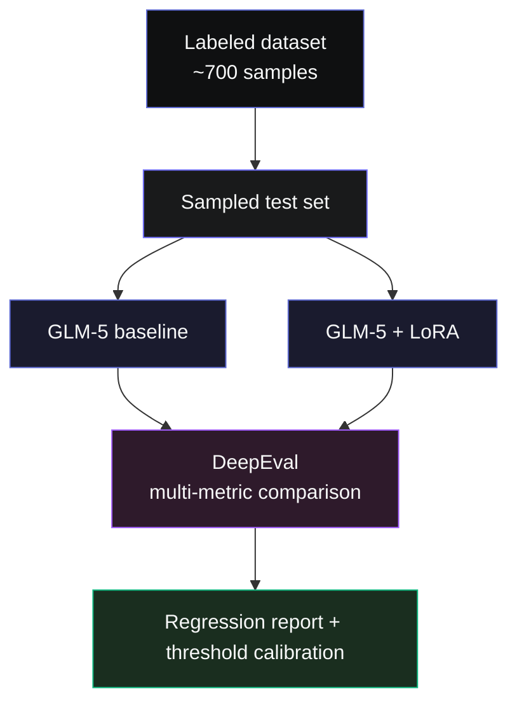

# GAD-7 <span class="accent">AI</span>-Assisted Assessment

<div class="subtitle">A Conversational Anxiety Screening System Powered by GLM-5 + LoRA Fine-Tuning</div>

<div class="cover-meta">
  <div><span class="label">Course</span><span class="value">AIE1902 · Psychology</span></div>
  <div><span class="label">Type</span><span class="value">Project Report · 25 Points</span></div>
  <div><span class="label">Demo Site</span><span class="value">SeetaCloud · Port 8443</span></div>
</div>

<div class="cover-foot">
  <span class="pill">GLM-5</span>
  <span class="pill">LoRA</span>
  <span class="pill">Dual-Agent</span>
  <span class="pill">FastAPI</span>
  <span class="pill">React</span>
  <span class="pill">SSE</span>
</div>

<!--
Opening (30s): One-line positioning.
We replace rigid forms with natural dialogue, so GAD-7 screening feels like a real conversation.
-->

---
layout: default
class: outline-page
---

# Outline <span class="muted">/ Scoring-Aligned Structure</span>

<div class="outline-grid">

<div class="outline-card">
  <div class="num">01</div>
  <div class="title">Introduction</div>
  <div class="desc">Mental-health context and project positioning</div>
  <div class="score">2 pts</div>
</div>

<div class="outline-card">
  <div class="num">02</div>
  <div class="title">Methods</div>
  <div class="desc">Architecture · Data · Prompting · LoRA · Scoring · Evaluation</div>
  <div class="score">5 pts</div>
</div>

<div class="outline-card">
  <div class="num">03</div>
  <div class="title">LLM Demonstration</div>
  <div class="desc">Three key highlights + live real-time demo</div>
  <div class="score">5 pts</div>
</div>

<div class="outline-card">
  <div class="num">04</div>
  <div class="title">Discussion</div>
  <div class="desc">Challenges · Lessons learned · Future work</div>
  <div class="score">2 pts</div>
</div>

</div>

<div class="outline-foot">
  Presentation Delivery 2 · Teamwork 2 · Peer Popularity 8 <span class="dim">— Total 25 pts</span>
</div>

---
layout: default
---

# 01 · Introduction <span class="muted">/ Problem We Solve</span>

<div class="intro-grid">

<div class="intro-block">
<div class="block-title accent">Background</div>

- **GAD-7** (Generalized Anxiety Disorder 7-item scale) is a widely used anxiety screening instrument
- Traditional form-based UX captures checkboxes, but often misses context and emotional nuance
- Users frequently answer with ambiguous phrases ("kind of", "often", "hard to say"), which forms cannot clarify

</div>

<div class="intro-block">
<div class="block-title accent">Goal</div>

Use LLM-based **natural conversation** instead of rigid forms:
- complete all 7 items through supportive dialogue
- collect **frequency**, not diagnosis
- **map responses to 0-3** with explainable evidence
- keep clear boundaries: **screening only**, never diagnosis

</div>

<div class="intro-block">
<div class="block-title accent">Delivery</div>

- **Web app with frontend-backend separation** (already deployed on SeetaCloud)
- users answer fully in natural language
- backend produces real-time questionnaire snapshots and structured reports

</div>

<div class="intro-block">
<div class="block-title accent">Non-goals</div>

- not a replacement for clinical diagnosis
- not a psychotherapy engine
- no collection of personally identifiable information

</div>

</div>

---
layout: default
class: arch-page
---

# 02 · Methods · System Architecture <span class="muted">/ Dual-AI Collaboration</span>



<div class="arch-note">
<span class="accent">Core idea</span>: dialogue generation and scoring are <strong>fully decoupled</strong>. Conversational quality does not contaminate scores, and scoring logic does not constrain response tone. Routing is controlled by <span class="mono">model_id</span> through a provider adapter layer.
</div>

---
layout: two-cols
class: data-page
---

# 02 · Methods · Dataset <span class="muted">/ In-house Annotation</span>

<div class="data-stat">
  <div class="stat-num">~700</div>
  <div class="stat-desc">human-annotated samples</div>
</div>

- **Source**: repository files `anotated/1.json` to `anotated/7.json`
- **Coverage**: all GAD-7 items, Q1-Q7
- **Fields per sample**:
  - `instruction` (item prompt)
  - `input` (user response)
  - `annotator_score` (0/1/2/3)
  - `annotator_confidence` (1/2/3)

::right::

<div class="dist-box">
<div class="dist-title">Score Distribution (Q1 Example)</div>

```
0 (Not at all)         ████████████████████  35%
1 (Several days)       ████████████          22%
2 (More than half)     ███████████████       28%
3 (Nearly every day)   ████████              15%
```

</div>

<div class="annot-sample">

<div class="sample-title">Annotated Sample Examples</div>

```json
{ "input": "I felt tense or anxious almost every day.",
  "annotator_score": "3", "annotator_confidence": "3" }
```

```json
{ "input": "Maybe a little... hard to describe.",
  "annotator_score": "1", "annotator_confidence": "1" }
```

</div>

---
layout: two-cols
class: prompt-page
---

# 02 · Methods · Dual-Prompt Design

<div class="prompt-block">
<div class="prompt-tag accent">A · Dialogue AI</div>
<div class="prompt-name">SYSTEM_INTERVIEWER_ZH</div>

- supportive and concise, **never outputs JSON**
- strict **Q1 → Q7 sequential progression**
- asks follow-up for ambiguity without score-leading language
- redirects off-topic requests back to the current item
- safety handling: crisis intent triggers emergency protocol guidance

</div>

<div class="prompt-block">
<div class="prompt-tag accent">B · Scoring AI</div>
<div class="prompt-name">SYSTEM_EXTRACT_ZH</div>

- **outputs JSON only**, hidden from users
- maps each item to 0-3 plus `confidence` and `needs_clarification`
- anchors: 0 not at all / 1 several days / 2 more than half / 3 nearly every day

</div>

::right::

<div class="json-demo">

<div class="json-title">Scoring AI Output Example</div>

```json
{
  "current_focus": "Q3",
  "items": {
    "Q1": {"score":2,"confidence":0.91,"needs_clarification":false},
    "Q2": {"score":2,"confidence":0.88,"needs_clarification":false},
    "Q3": {"score":null,"confidence":0.42,
           "needs_clarification":true,"brief_reason":"ambiguous"},
    "Q4": {"score":null,"confidence":0.0,"needs_clarification":true}
  },
  "ready_for_summary": false,
  "off_topic_redirected": false
}
```

</div>

<div class="prompt-foot">
<span class="accent mono">decoupled</span> means the same user message is interpreted independently by two models, then reconciled by rules to avoid "free text = direct score" failure modes.
</div>

---
layout: default
class: lora-page
---

# 02 · Methods · LoRA Fine-Tuning <span class="muted">/ Core Project Highlight</span>

<div class="lora-grid">

<div class="lora-col">
<div class="col-title accent">Why Fine-Tune</div>

- vanilla GLM-5 tends to over-empathize and may skip explicit frequency alignment
- inconsistent handling of ambiguous phrases across repeated runs
- occasional malformed or incomplete JSON in extraction mode

</div>

<div class="lora-col">
<div class="col-title accent">LoRA Setup</div>

| Item | Setting |
|---|---|
| Base | GLM-5 |
| Method | LoRA / QLoRA |
| Data | In-house labeled dataset (~700) |
| Objective | Frequency mapping + JSON format reliability |
| Target model | Scoring AI (Extractor) |

</div>

<div class="lora-col">
<div class="col-title accent">Observed Gains (Qualitative)</div>

- **higher JSON validity** with fewer parsing failures
- **more stable bucket mapping** for ambiguous responses
- **better confidence alignment** with annotator confidence labels
- no major inference latency increase (lightweight LoRA adapters)

</div>

</div>

<div class="lora-foot">
<span class="muted">Note: the Dialogue AI remains on base GLM-5, while only the <strong style="color:var(--text-secondary)">Scoring AI</strong> is LoRA-tuned. This keeps cost low and risk controlled.</span>
</div>

---
layout: default
class: scoring-page
---

# 02 · Methods · Scoring Engine <span class="muted">/ Focus-Item State Machine</span>

<div class="scoring-flex">

<div class="scoring-mermaid">



</div>

<div class="scoring-text">

<div class="rule-box">
<div class="rule-title accent">Key Rules</div>

- **tau_high = 0.85** · **tau_low = 0.55**
- **focus_only**: update only the first unfinished item to prevent one-shot filling of Q1-Q7
- locked items are immutable unless `/rescore` is explicitly triggered
- all seven locked -> `ready_for_summary = true`

</div>

<div class="rule-box">
<div class="rule-title accent">Explainability</div>

- each item stores `evidence_spans` (message-level references)
- report page outputs per-item `rationale`
- full pipeline is auditable and replayable

</div>

</div>

</div>

---
layout: two-cols
class: eval-page
---

# 02 · Methods · DeepEval Evaluation

<div class="eval-block">
<div class="block-title accent">Evaluation Framework</div>

Built on **DeepEval**, a mainstream LLM evaluation toolkit.

- unit-style test cases over dialogue samples
- custom metric support
- CI-integrated regression checks on model updates

</div>

<div class="eval-block">
<div class="block-title accent">Primary Metrics</div>

| Metric | Description |
|---|---|
| Item Accuracy | model score vs annotated ground truth |
| Total Score MAE | average absolute error on summed GAD-7 scores |
| JSON Validity | parseable output rate (before vs after LoRA) |
| Ambiguity Trigger Rate | proportion flagged as `needs_clarification` |

</div>

::right::

<div class="eval-flow">
<div class="flow-title">Evaluation Pipeline</div>



</div>

<div class="eval-foot">
<span class="muted">Every LoRA checkpoint update must pass full regression before deployment.</span>
</div>

---
layout: default
class: highlights-page
---

# 03 · LLM Demonstration <span class="muted">/ Three Highlights</span>

<div class="hl-grid">

<div class="hl-card">
  <div class="hl-num">01</div>
  <div class="hl-icon">🎯</div>
  <div class="hl-title">Domain LoRA Fine-Tuning</div>
  <div class="hl-body">
    We fine-tune GLM-5 with our in-house labels to improve frequency-to-score mapping and JSON output robustness specifically for the scoring model.
  </div>
  <div class="hl-tag">Methods Core</div>
</div>

<div class="hl-card">
  <div class="hl-num">02</div>
  <div class="hl-icon">🔀</div>
  <div class="hl-title">Dual-AI Collaboration</div>
  <div class="hl-body">
    <strong>Dialogue AI</strong> handles empathy and interview flow; <strong>Scoring AI</strong> handles structured extraction. The two are fully decoupled and reconciled by orchestration rules.
  </div>
  <div class="hl-tag">Unique Design</div>
</div>

<div class="hl-card">
  <div class="hl-num">03</div>
  <div class="hl-icon">📋</div>
  <div class="hl-title">JSON Sidecar + Threshold Locking</div>
  <div class="hl-body">
    Structured sidecar outputs combined with dual thresholds and focus-item state logic make scoring explainable, auditable, and resistant to vague-response contamination.
  </div>
  <div class="hl-tag">Engineering Highlight</div>
</div>

</div>

<div class="hl-foot">
<span class="accent">Next slide: live website demo with real-time questionnaire snapshot updates.</span>
</div>

---
layout: iframe
url: https://u878057-9275-7582ea09.bjb2.seetacloud.com:8443/
class: demo-iframe-page
---

<!--
Full-screen live demo slide:
- open the production site and run a live conversation
- focus on real-time snapshot updates in the side panel
- suggested demo cases: mild (Q1=1), moderate (Q1=2), severe (Q1=3), and one ambiguous response
- fallback: switch to backup screenshot if network is unstable
- if iframe is blocked by X-Frame-Options/CSP, open the site in a new browser tab
-->

---
layout: default
class: discussion-page
---

# 04 · Discussion <span class="muted">/ Challenges and Lessons</span>

<div class="disc-grid">

<div class="disc-card">
  <div class="disc-tag">Challenge 1</div>
  <div class="disc-title accent">Boundary of Dual-AI Responsibilities</div>
  <div class="disc-body">

  **Problem**: early versions leaked scoring logic into conversational responses because ambiguity judgment was not fully isolated.

  **Resolution**:
  - Dialogue AI cannot access `score`; it only sees state hints like "Q3 needs clarification"
  - Scoring AI does not rely on assistant text style; it reads user content and locked states
  - Orchestrator remains the single source of truth

  </div>
</div>

<div class="disc-card">
  <div class="disc-tag">Challenge 2</div>
  <div class="disc-title accent">Clarifying Ambiguous User Responses</div>
  <div class="disc-body">

  **Problem**: inputs like "kind of" or "often" can lead to premature low-confidence scoring.

  **Resolution**:
  - enforce `score=null` and `needs_clarification=true` for ambiguous phrases in extraction prompts
  - require one neutral follow-up question from Dialogue AI to map to the four official buckets
  - keep `_heuristic_score` keyword logic as a controlled fallback path

  </div>
</div>

<div class="disc-card">
  <div class="disc-tag">Challenge 3</div>
  <div class="disc-title accent">Stable JSON Output Reliability</div>
  <div class="disc-body">

  **Problem**: baseline GLM-5 occasionally produced malformed JSON, missing fields, or leaked JSON into user-visible replies.

  **Resolution**:
  - parse-layer cleanup strips markdown fences before JSON decoding
  - schema validation with default backfilling (`score=null`) for missing fields
  - LoRA tuning significantly improved valid-JSON rate

  </div>
</div>

</div>

---
layout: default
class: future-team-page
---

# Future Work <span class="muted">/ & Team</span>

<div class="ft-grid">

<div class="ft-block">
<div class="block-title accent">Next Steps</div>

- **Plug in in-house inference service** with `model_id` routing while keeping upper-layer APIs unchanged
- **Extend to more scales**: PHQ-9 (depression), PSS-10 (stress) with shared scoring engine
- **Automate offline evaluation** for every LoRA checkpoint via DeepEval
- **Add dedicated safety classifier** for crisis-intent escalation handling
- **Introduce long-dialogue compression** to control token costs

</div>

<div class="ft-block">
<div class="block-title accent">Team & Responsibilities</div>

| Role | Member | Responsibility |
|---|---|---|
| Model / LoRA | _TBD_ | data prep, LoRA training, DeepEval |
| Backend / Orchestration | _TBD_ | FastAPI, state machine, provider adapter |
| Frontend / UI | _TBD_ | React, SSE streaming, Linear-style UX |
| Data Annotation | _TBD_ | in-house labeling and confidence review |
| Deployment / Ops | _TBD_ | SeetaCloud deployment, HTTPS domain |

<div class="team-note">Please share final names after rehearsal and I will replace all _TBD_ entries.</div>

</div>

</div>

---
layout: cover
class: end-page
---

<div class="end-wrap">

<div class="end-title">Thank You · Q&A</div>

<div class="end-meta">

  <div class="meta-row">
    <span class="meta-label">Demo Site</span>
    <a class="meta-value" href="https://u878057-9275-7582ea09.bjb2.seetacloud.com:8443/" target="_blank">
      https://u878057-9275-7582ea09.bjb2.seetacloud.com:8443
    </a>
  </div>

  <div class="meta-row">
    <span class="meta-label">Repository</span>
    <a class="meta-value" href="https://github.com/A1motoro/aie1902-psychology" target="_blank">
      github.com/A1motoro/aie1902-psychology
    </a>
  </div>

  <div class="meta-row">
    <span class="meta-label">Course</span>
    <span class="meta-value">AIE1902 · Psychology Project</span>
  </div>

</div>

<div class="end-tags">
  <span class="pill">GLM-5</span>
  <span class="pill">LoRA</span>
  <span class="pill">Dual-Agent</span>
  <span class="pill">DeepEval</span>
  <span class="pill">SSE</span>
  <span class="pill">FastAPI</span>
  <span class="pill">React</span>
</div>

</div>
